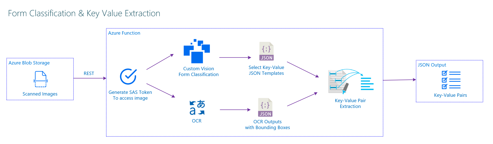
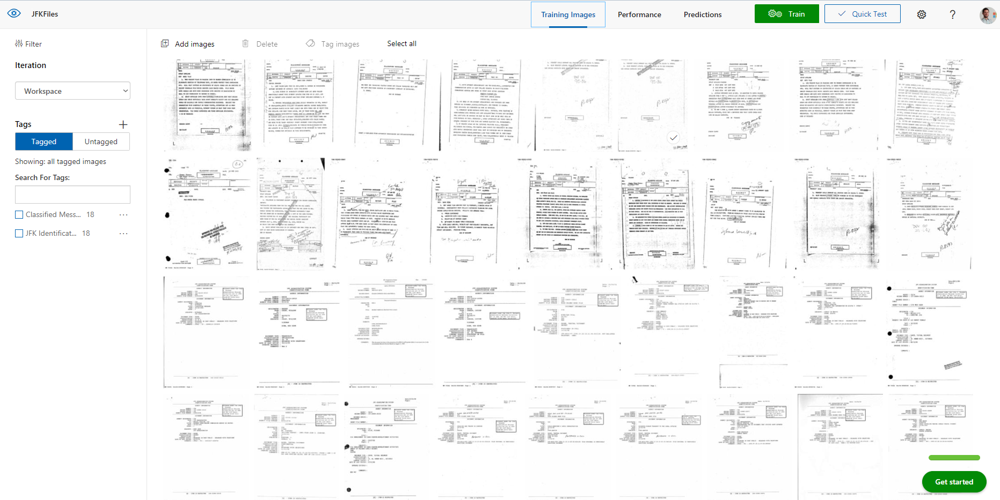
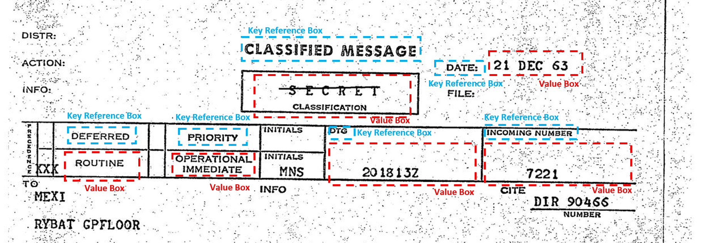
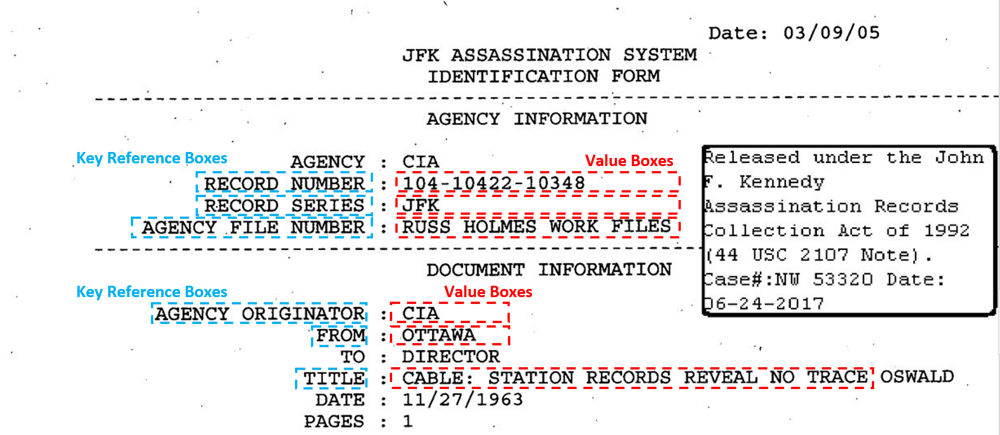

# Document Classification and Post-OCR Key-Value Extraction

This an Azure Function sample that accepts Form Image url inputs from the user and extract needed information into a json output. You can use structured and semi-structured Forms to Extract details.

As a test dataset I used JFK Files documents to classify and extract key-value pairs.

This application has been created using Microsoft Azure Functions.



Document classification for JFK files and Post-OCR key-value extraction from froms.


## Custom Vision for Document Classification

For document classification, Custom Vision Services is used to classify document types. In this sample we have 2 sample documents and these using partly different templates. Custom Vision AI is very good at classifing these kind of documents.

Here's a screenshot from the portal below.



## SAS Access token for private Azure Blob Storage Containers

A shared access signature (SAS) provides you with a way to grant limited access to objects in your storage account to other clients, without exposing your account key. For more details about
[Using shared access signatures (SAS)](https://docs.microsoft.com/en-us/azure/storage/common/storage-dotnet-shared-access-signature-part-1)


## Post-OCR Processing: Defining Reference Text (Key) and Desired Value Margins

This technique uses location of bounding boxes returned by Microsoft Cognitive Services OCR API. Region of the key reference texts are defined in a JSON file. Search data notation is like below format:

```json
{
  "id": 2,
  "text": "PRIORITY",   // Your Reference Text Value
  "marginX": -30,       // Margin to left of your value field
  "marginY": -30,       // Margin to left top your value field
  "width": 100,         // Width of your text area
  "height": 100         // Height of your text area
}
```

The output regions for above definition will be like below



---
## Extract Key-Values from Mixed Structured Content

Let's use one of the files from JFK Files like below we're targeting to extract 
`CLASSIFIED MESSAGE` , `DEFERRED` , `PRIORITY`, `DTG`, `INCOMING NUMBER` and  `DATE` values. 


JSON fields for regions will be like below.
This file is located under `Resources` > `ClassifiedMessages.json`

```json
[
  {
    "id": 0,
    "text": "CLASSIFIED MESSAGE",
    "marginX": 5,
    "marginY": -30,
    "width": 200,
    "height": 120
  },
  {
    "id": 1,
    "text": "DEFERRED",
    "marginX": -30,
    "marginY": -30,
    "width": 100,
    "height": 100
  },
  {
    "id": 2,
    "text": "PRIORITY",
    "marginX": -30,
    "marginY": -30,
    "width": 100,
    "height": 100
  },
  {
    "id": 3,
    "text": "DTG",
    "marginX": 5,
    "marginY": -30,
    "width": 200,
    "height": 200
  },
  {
    "id": 4,
    "text": "INCOMING NUMBER",
    "marginX": 0,
    "marginY": -30,
    "width": 200,
    "height": 100
  },
  {
    "id": 5,
    "text": "DATE",
    "marginX": 50,
    "marginY": 20,
    "width": 300,
    "height": 50
  }
]
```
After above definitions search regions will be set like below


And after that, we'll be succesfully extract like below. 


## Extract Key-Values from Semi-Structured Content

Let's use one of the files from JFK Files like below we're targeting to extract 
`FROM` , `TITLE` , `AGENCY ORIGINATOR`, `RECORD NUMBER`, `RECORD SERIES` and  `AGENCY FILE NUMBER` values. 


 
JSON fields for regions will be like below.

This file is located under `Resources` > `JFKIdentificationForm.json`

```json
[
  {
    "id": 0,
    "text": "RECORD NUMBER",
    "marginX": 220,
    "marginY": 5,
    "width": 300,
    "height": 25
  },
  {
    "id": 1,
    "text": "RECORD SERIES",
    "marginX": 220,
    "marginY": 5,
    "width": 300,
    "height": 20
  },
  {
    "id": 2,
    "text": "AGENCY FILE NUMBER",
    "marginX": 300,
    "marginY": 5,
    "width": 300,
    "height": 25
  },
  {
    "id": 3,
    "text": "AGENCY ORIGINATOR",
    "marginX": 200,
    "marginY": 5,
    "width": 150,
    "height": 25
  },
    {
    "id": 4,
    "text": "FROM",
    "marginX": 50,
    "marginY": 5,
    "width": 150,
    "height": 25
  },
 {
    "id": 5,
    "text": "TITLE",
    "marginX": 50,
    "marginY": 5,
    "width": 600,
    "height": 25
  }
]
```

After above definitions search regions will be set like below


And after that, we'll be succesfully extract like below.


